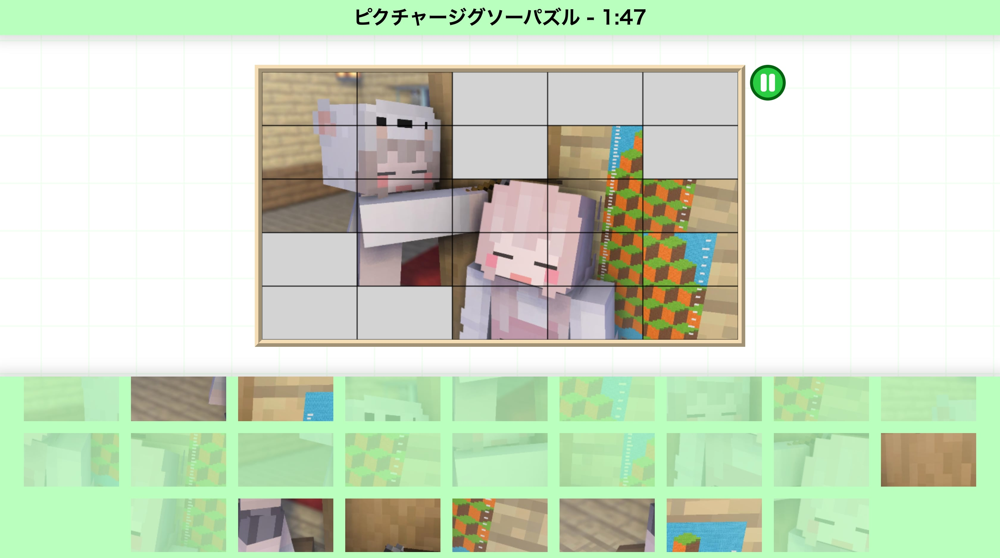

# ピクチャージクソーパズル

デバイス上の画像でジグソーパズルを楽しめるアプリケーションです。パズルのピース数は自由に設定可能です。アップロードされた画像はパズルを生成する目的のみに使用され、外部に送信されることはありません。

https://gakuto1112.github.io/PictureJigsawPuzzle/



## 遊び方
1. アクセスするとまずメインメニューが表示されます。灰色の画像枠（「クリックして画像を選択」と書いてあります）をクリック/タップして画像を選択して下さい。
   - 使用できる拡張子は```png```、```jpg```、```jpeg```、```gif```です。それ以外は使用できません。
   - gif画像はアニメーションしません。
   - 使用する画像の縦横比は**16:9**を推奨しますが、画像の縦横比はどんなものでも可能です。ただし、縦横比が極端なものではプレイしにくくなります。
2. 縦のピース数と横のピース数を入力します。初期状態では縦横共に5ピースに設定されています。
	- 指定できる数は1以上の整数（自然数）です。ただし、縦横共に1ピースには設定できません。
	- ピース数を極端に多く設定すると、処理の負荷が高くなるだけではなく、1つずつのピースが非常に小さくなるのでプレイしにくくなります。
3. 任意で、BGMと効果音の音量を上げます。左（音符）がBGM、右（音叉）が効果音の音量スライダーとなっています。
	- 初期状態が0となっているのは、アクセスした瞬間、音楽が流れないようにするためです。そもそも、ブラウザの仕様により自動で音楽は流せなくなっています。
4. 「スタート」ボタンでゲームを開始します。ピースのシャッフルが終わり、「START」の表示がされるとゲームスタートです。
	- 画面下部のピース一覧のピースを選ぶと選択状態（点滅します）になり、その状態でパズル盤をクリックすると、クリック/タップしたますにピースが置かれます。
	- パズル盤上のピースを選んで別のますをクリック/タップするとピースの移動ができます。
	- パズル盤上のピースを2つ選ぶと2つのピースの場所を入れ替えます。
	- パズル盤上のピースを2回クリック/タップするとそのピースをピース一覧に戻します。
5. 全てのピースを正しい位置に並べるとゲームクリアです。
   - かかった時間が表示されます。
   - 「Twitterに投稿」をクリックすると[Twitter](https://twitter.com/home)に結果を投稿できます。

## 一時停止メニュー
ゲーム中にパズル盤右上の一時停止ボタンをクリック/タップするとゲームを一時停止でき、タイマーも一時停止します。一時停止メニューでは、元の画像を確認できます。

## 注意事項
- キャンバス描画に対応していないブラウザではプレイできません。
- ブラウザの画面サイズは**1000px × 834px**以上を推奨します。これ未満でもプレイできますが、スクロールする必要があるのでゲーム中に煩わしさを感じるかもしれません。
- スマートフォンからは、画面サイズ上、プレイしにくいかもしれません。
- 検証に用いたブラウザは「[Chrome](https://www.google.com/intl/ja_jp/chrome/)」と「[Safari](https://www.apple.com/jp/safari/)」です。これら以外のブラウザは未検証です。表示がおかしい、動作がおかしい/しない可能性があります。